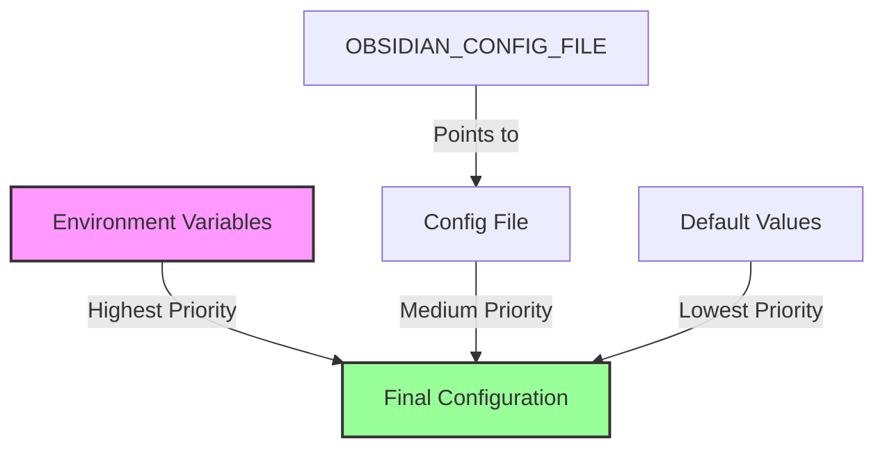

# Configuration Guide

This guide provides comprehensive documentation for configuring the Obsidian MCP Server.

## Table of Contents

- [Overview](#overview)
- [Configuration Sources](#configuration-sources)
- [Configuration Hierarchy](#configuration-hierarchy)
- [Environment Variables](#environment-variables)
- [Configuration File](#configuration-file)
- [Advanced Configuration](#advanced-configuration)
- [Multiple Vault Setup](#multiple-vault-setup)
- [Security Considerations](#security-considerations)
- [Troubleshooting](#troubleshooting)

## Overview

The Obsidian MCP Server uses a flexible configuration system that supports multiple sources and precedence levels. This allows you to configure the server for various use cases, from simple single-vault setups to complex multi-vault environments.

## Configuration Sources

The server checks for configuration in the following order (highest to lowest precedence):

1. **Environment Variables** - Direct environment variable settings
2. **Configuration File** - JSON configuration file
3. **Default Values** - Built-in defaults

### Why This Order?

- Environment variables allow temporary overrides without modifying files
- Configuration files provide persistent settings
- Defaults ensure the server works out of the box

## Configuration Hierarchy



## Environment Variables

### Available Variables

| Variable | Description | Default | Required |
|----------|-------------|---------|----------|
| `OBSIDIAN_API_KEY` | API key from Obsidian REST API plugin | None | Yes |
| `OBSIDIAN_HOST` | Host where Obsidian is running | `127.0.0.1` | No |
| `OBSIDIAN_CONFIG_FILE` | Path to custom config file | `~/.config/mcp/obsidian.json` | No |

### Setting Environment Variables

#### Linux/macOS (Bash/Zsh)
```bash
export OBSIDIAN_API_KEY="your-api-key-here"
export OBSIDIAN_HOST="192.168.1.100"
```

#### Windows (Command Prompt)
```cmd
set OBSIDIAN_API_KEY=your-api-key-here
set OBSIDIAN_HOST=192.168.1.100
```

#### Windows (PowerShell)
```powershell
$env:OBSIDIAN_API_KEY = "your-api-key-here"
$env:OBSIDIAN_HOST = "192.168.1.100"
```

### Persistent Environment Variables

#### Linux/macOS
Add to `~/.bashrc`, `~/.zshrc`, or `~/.profile`:
```bash
export OBSIDIAN_API_KEY="your-api-key-here"
```

#### Windows
Use System Properties → Environment Variables to set permanently.

## Configuration File

### File Structure

The configuration file uses JSON format:

```json
{
  "apiKey": "your-api-key-here",
  "host": "127.0.0.1"
}
```

### Default Location

- **Linux/macOS**: `~/.config/mcp/obsidian.json`
- **Windows**: `%USERPROFILE%\.config\mcp\obsidian.json`

### Creating the Configuration

1. Create the directory structure:
   ```bash
   mkdir -p ~/.config/mcp
   ```

2. Create the configuration file:
   ```bash
   cat > ~/.config/mcp/obsidian.json << EOF
   {
     "apiKey": "your-api-key-here",
     "host": "127.0.0.1"
   }
   EOF
   ```

3. Set appropriate permissions:
   ```bash
   chmod 600 ~/.config/mcp/obsidian.json
   ```

### Using a Custom Location

```bash
export OBSIDIAN_CONFIG_FILE="/path/to/your/config.json"
```

## Advanced Configuration

### Multiple Configuration Files

You can maintain multiple configuration files for different vaults:

```bash
# Work vault
export OBSIDIAN_CONFIG_FILE="~/.config/mcp/work-vault.json"

# Personal vault
export OBSIDIAN_CONFIG_FILE="~/.config/mcp/personal-vault.json"
```

### Configuration File Template

Use the provided `obsidian-config-template.json` as a starting point:

```bash
cp obsidian-config-template.json ~/.config/mcp/obsidian.json
# Edit the file with your API key
```

### Remote Obsidian Instance

If Obsidian is running on another machine:

```json
{
  "apiKey": "your-api-key-here",
  "host": "192.168.1.100"
}
```

Ensure the REST API plugin is configured to accept connections from your IP.

## Multiple Vault Setup

### Option 1: Environment Variable Switching

Create shell aliases for different vaults:

```bash
# In ~/.bashrc or ~/.zshrc
alias obsidian-work='export OBSIDIAN_CONFIG_FILE=~/.config/mcp/work.json'
alias obsidian-personal='export OBSIDIAN_CONFIG_FILE=~/.config/mcp/personal.json'
```

### Option 2: Claude Desktop Profiles

Configure multiple servers in Claude Desktop:

```json
{
  "mcpServers": {
    "obsidian-work": {
      "command": "npx",
      "args": ["obsidian-mcp-ts"],
      "env": {
        "OBSIDIAN_CONFIG_FILE": "/home/user/.config/mcp/work.json"
      }
    },
    "obsidian-personal": {
      "command": "npx",
      "args": ["obsidian-mcp-ts"],
      "env": {
        "OBSIDIAN_CONFIG_FILE": "/home/user/.config/mcp/personal.json"
      }
    }
  }
}
```

### Option 3: Script-Based Switching

Create a wrapper script:

```bash
#!/bin/bash
# obsidian-mcp-switch.sh

case "$1" in
  work)
    export OBSIDIAN_CONFIG_FILE=~/.config/mcp/work.json
    ;;
  personal)
    export OBSIDIAN_CONFIG_FILE=~/.config/mcp/personal.json
    ;;
  *)
    echo "Usage: $0 {work|personal}"
    exit 1
    ;;
esac

npx obsidian-mcp-ts
```

## Security Considerations

### File Permissions

Always restrict access to configuration files containing API keys:

```bash
# Linux/macOS
chmod 600 ~/.config/mcp/obsidian.json

# Verify permissions
ls -la ~/.config/mcp/obsidian.json
# Should show: -rw-------
```

### API Key Security

1. **Never commit API keys** to version control
2. **Use .gitignore** for config files:
   ```gitignore
   obsidian.json
   *.config.json
   .config/
   ```

3. **Rotate API keys** periodically
4. **Use different keys** for different environments

### Environment Variable Security

Be cautious with environment variables in:
- Shell history files
- Process listings (`ps` command)
- Log files
- CI/CD systems

## Troubleshooting

### Common Issues

#### API Key Not Found

**Error Message:**
```
OBSIDIAN_API_KEY not found. Please provide it via:
1. OBSIDIAN_API_KEY environment variable
2. Config file at ~/.config/mcp/obsidian.json
3. Custom config file via OBSIDIAN_CONFIG_FILE environment variable
```

**Solutions:**
1. Verify environment variable is set: `echo $OBSIDIAN_API_KEY`
2. Check config file exists: `ls -la ~/.config/mcp/obsidian.json`
3. Verify JSON syntax: `cat ~/.config/mcp/obsidian.json | jq .`

#### Connection Failed

**Possible Causes:**
1. Obsidian not running
2. REST API plugin not enabled
3. Incorrect host/port
4. Firewall blocking connection

**Debug Steps:**
```bash
# Test connection
curl -k https://127.0.0.1:27124/

# Check if port is open
nc -zv 127.0.0.1 27124

# Verify REST API is running in Obsidian
# Settings → Community Plugins → Local REST API → Enabled
```

#### Invalid Configuration File

**Symptoms:**
- Server ignores config file
- Falls back to environment variables

**Debug:**
```bash
# Validate JSON syntax
python -m json.tool < ~/.config/mcp/obsidian.json

# Check file permissions
ls -la ~/.config/mcp/obsidian.json

# Test with explicit path
OBSIDIAN_CONFIG_FILE=/full/path/to/config.json npx obsidian-mcp-ts
```

### Debug Mode

Enable debug logging by setting:
```bash
export DEBUG=obsidian-mcp:*
```

This will show:
- Configuration loading process
- Which sources were checked
- Final configuration values used

### Testing Configuration

Use the MCP Inspector to test your configuration:

```bash
npx @modelcontextprotocol/inspector npx obsidian-mcp-ts
```

This allows you to:
- Verify the server starts correctly
- Test individual tools
- See actual requests/responses

## Configuration Examples

### Local Development
```json
{
  "apiKey": "dev-api-key-12345",
  "host": "127.0.0.1"
}
```

### Remote Vault Access
```json
{
  "apiKey": "remote-api-key-67890",
  "host": "192.168.1.50"
}
```

### Custom Port
```json
{
  "apiKey": "custom-port-key",
  "host": "127.0.0.1:27125"
}
```

Note: Port configuration is not yet implemented in the current version. The server always uses port 27124.

## Performance Notes

The ConfigLoader uses a singleton pattern and caches configuration after first load. This means:

- Configuration is only read from disk once per session
- No performance impact on repeated API calls
- Changes to configuration files require server restart
- Environment variable changes require server restart

This design ensures optimal performance while maintaining configuration flexibility.